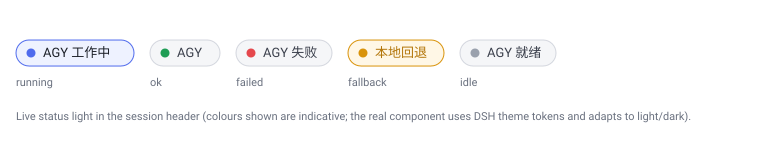

# agy-first-bridge

[简体中文](README.md) · **English**

> A Cordis plugin for the **DeepSeek Harness (DSH)** that makes the model **prefer the local `agy` CLI** for real work (coding, builds, debugging, multi-file investigation) across **every mode**. DSH stays fully in control of agy (`--dangerously-skip-permissions`, so agy never prompts). When agy is **rate-limited or the network is down**, it pops a confirmation dialog asking whether to fall back to the **DSH local API config**, and it shows a **live status light** in the session header indicating whether agy is currently working.



---

## What it is

`agy-first-bridge` contributes two things to a running DSH session:

1. **Three model tools** — `agy_run`, `agy_continue` and `agy_status`, which hand tasks to the local `agy` CLI.
2. **An agy-first policy prompt section** — instructs the model to prefer agy for real work in **all modes** (normal / plan / accept-edits / subagent / workflow / ralph / goal rounds); native tools are reserved for read-only lookups and final verification.

On top of that it implements the key capabilities that motivated the project:

- **Fallback mechanism (confirmation dialog):** when agy looks rate-limited or the network is unreachable, a dialog pops up offering *"use the DSH local API config (fall back)" / "retry agy once" / "do not fall back"*.
- **Live status light:** a coloured indicator on the right of the browser session header that reflects agy activity in real time (working / ok / failed / fallback / idle); hovering it shows the step agy is currently executing.
- **Live observation (`agy_status`):** the `agy_status` tool returns a snapshot of what agy is doing RIGHT NOW — the current step (tool name + arguments, or thinking/typing), the recent step trail, and the last completed run. Callable mid-flight, no waiting.

## Three forms

The same logic ships in three forms; pick per need:

| Form | Location | Capabilities | Survives restart | Status light |
| --- | --- | --- | --- | --- |
| **Persistent agent preset** (recommended) | [`preset/agy-first/`](preset/agy-first/) | tools + policy + fallback dialog + `agy_status` | ✅ yes (persisted preset) | ❌ no (host-plane composition has no browser UI) |
| **Dynamic Cordis plugin** (in-session) | [`dynamic/`](dynamic/) | tools + policy + fallback dialog + **status light** + `agy_status` | ❌ no (process-local) | ✅ yes (one-time approval) |
| **MCP server** (any MCP host) | [`mcp/`](mcp/) | `agy_run` / `agy_continue` / `agy_status` auto-discovered via `tools/list` by Claude Code, Codex, Cherry Studio, … | ✅ yes (registered in client config) | ❌ no |

> **Why is the status light only in the dynamic form?** An agent preset is a **host-plane** composition (`agent.cordis.yml` mounts host plugins), and its `.mjs` runs only on the Node side, so it inherently has no browser UI. The live status light is a **client-plane** (browser Slot) component that must be loaded through the client half of a dynamic Cordis plugin (approved once in the GUI on first run). The fallback dialog is a host-side capability and is present in **both** forms.

See [docs/en/ARCHITECTURE.md](docs/en/ARCHITECTURE.md).

## Quick start

### Option A: install as a persistent agent preset (recommended)

Copy the whole `preset/agy-first/` directory into your DSH user preset root:

```
${DSH_HOME:-$HOME/.dsh}/.agent-presets/agy-first/
```

Windows example (this repo's dev environment):

```powershell
Copy-Item -Recurse .\preset\agy-first "$env:DSH_HOME\.agent-presets\agy-first"
```

Then start a new DSH session and select the preset named **`Agy-First 执行代理`** (id: `agy-first`). It inherits everything from the `standard` preset and adds the `agy_run` / `agy_continue` tools, the agy-first policy, and the rate-limit/network fallback dialog.

> ⚠️ **Do not** edit the shipped `agent-presets` install that ships with the deployment (an upgrade overwrites it). Always install under your **user** preset root as a separate subdirectory.

Full steps and validation are in [docs/en/INSTALL.md](docs/en/INSTALL.md).

### Option B: run as a dynamic Cordis plugin (with the status light)

In a DSH session that has Cordis capabilities loaded, define and activate the plugin with `cordis_define` + `cordis_run`, using [`dynamic/host.js`](dynamic/host.js) for the host half and [`dynamic/client.js`](dynamic/client.js) for the client half. The first time the client half runs, the DSH GUI asks for a one-time approval; once granted, the status light appears in the session header.

## Requirements

- **DeepSeek Harness (DSH)** with the needed host services mounted: `tools`, `subprocess`, `systemPrompt`, `timer` (optional: `jobs`, `planMode`, `sandboxPolicy`, `userQuestions`).
- A local **`agy` CLI** available on `PATH` (verified against v1.1.22 during development).
- The DSH Web GUI (client plane) is additionally required for the status light.

## Tool usage

`agy_run(prompt, mode?, model?, effort?, cwd?, addDirs?, timeoutSec?, background?)`

- `mode`: `auto` (default — follows DSH plan state, choosing `plan`/`accept-edits`), `plan`, `accept-edits`.
- `background: true`: run as a background job and return a `jobId`; collect via `job_output`.
- Returns: `{ ok, status, response, conversationId, durationSeconds, numTurns, totalTokens, exitCode, mode, stderr }`; on fallback it is `{ ok:false, fallback:true, status:'FALLBACK_TO_DSH', ... }`.

`agy_continue(prompt, conversationId? | latest?, ...)` — continue an existing agy conversation; other parameters as above.

`agy_status()` — **live observation**: returns a snapshot of what agy is doing right now (`{ state, running, current, trail, lastStatus, lastConversationId, updatedAt }`). `current` is the step currently executing (tool name + arguments, or agent_response thinking/typing); `trail` is the recent step history. Callable while `agy_run`/`agy_continue` is in flight, no waiting.

## DSH fully controls agy

Every agy call is forced with `--dangerously-skip-permissions` and `--output-format stream-json`, so **agy never prompts and never asks before editing files**; mode, model, effort, working directory, timeout, background, and cancellation are all decided by DSH, and a run can be cancelled through `exec.signal` + `handle.terminate()`. Each `step_update` event from the stream feeds the `agy_status` snapshot in real time.

## Fallback & status light

See [docs/en/FALLBACK-AND-INDICATOR.md](docs/en/FALLBACK-AND-INDICATOR.md). Highlights:

- Failure detection: non-zero exit, or `stderr/response/status` matching `rate limit / 429 / quota / timeout / ECONN* / network / …` (plus Chinese equivalents).
- The dialog uses DSH's `userQuestions.ask()`; when there is no live human answerer (e.g. a delegated subagent) the dialog is skipped and an error is returned, avoiding a permanent block.
- At most 2 attempts (no loops); background failures do not open the dialog (re-run in the foreground to be prompted).
- The status light polls the host `agy_status` RPC every 1.2s; colours come from theme tokens and adapt to light/dark.

## Repository layout

```
agy-first-bridge/
├─ README.md / README.en.md
├─ LICENSE
├─ .gitignore
├─ package.json                    # version metadata (v1.3.0, Node >=18)
├─ MCP-POLICY.md                   # disclose-and-prefer policy for external agents (also ~/.claude/CLAUDE.md, ~/.codex/AGENTS.md)
├─ .github/workflows/ci.yml       # node --check + YAML validation
├─ assets/indicator-states.svg    # status-light states diagram
├─ preset/
│  └─ agy-first/                   # persistent agent preset (recommended)
│     ├─ preset.yml
│     ├─ agent.cordis.yml          #   standard + one agy plugin row
│     └─ agy-first-bridge.mjs      #   self-contained, dependency-free host module
├─ dynamic/                        # dynamic Cordis plugin form (with status light)
│  ├─ host.js                      #   code.host body
│  └─ client.js                    #   code.client body (browser status light)
├─ mcp/                            # MCP server (discoverable by any MCP host)
│  ├─ agy-mcp-server.mjs           #   zero-dependency stdio MCP server
│  └─ README.md                    #   registration (Claude Code / Codex / DSH / generic)
└─ docs/
   ├─ INSTALL.md / ARCHITECTURE.md / FALLBACK-AND-INDICATOR.md / CHANGELOG.md   (中文)
   └─ en/INSTALL.md / ARCHITECTURE.md / FALLBACK-AND-INDICATOR.md               (English)
```

## Versions & releases

Semantic versioning via `package.json` + Git tags + GitHub Releases (see [docs/CHANGELOG.md](docs/CHANGELOG.md)):

| Version | Highlights |
| --- | --- |
| [v1.3.0](https://github.com/new-256/agy-first-bridge/releases/tag/v1.3.0) | **Live observation**: all forms run agy with `stream-json` and parse `step_update` events; new `agy_status` tool (current step / trail / last run); status-light tooltip shows the current step |
| [v1.2.0](https://github.com/new-256/agy-first-bridge/releases/tag/v1.2.0) | DSH auto-start (default preset `cordis-agy`), in-DSH MCP registration, external MCP registration (Claude Code / Codex), disclose-and-prefer policy, version management |
| [v1.1.0](https://github.com/new-256/agy-first-bridge/releases/tag/v1.1.0) | Zero-dependency MCP server discoverable by any MCP host, CI extension |
| [v1.0.0](https://github.com/new-256/agy-first-bridge/releases/tag/v1.0.0) | agy bridge tools, full DSH control, fallback dialog, status light, both forms, docs & CI |

## Security notes

- `--dangerously-skip-permissions` means agy will edit files and run commands without asking again. This is the direct implementation of the "DSH fully controls agy" requirement; use it only where you trust agy's execution environment.
- The plugin only registers into the host `tools` / `systemPrompt` registries and exposes one package-private read-only `agy_status` RPC; it publishes no cross-session service, so it is safe on the preset plane (no isolate realm needed).
- All side effects (tool registration, prompt section, styles, timers) are attached to the current fiber via `ctx.effect` / `ctx.tools.register` / `ctx.timeout`, and are cleaned up automatically on stop / update / undefine.

## License

[MIT](LICENSE) © 2026 chenglong
